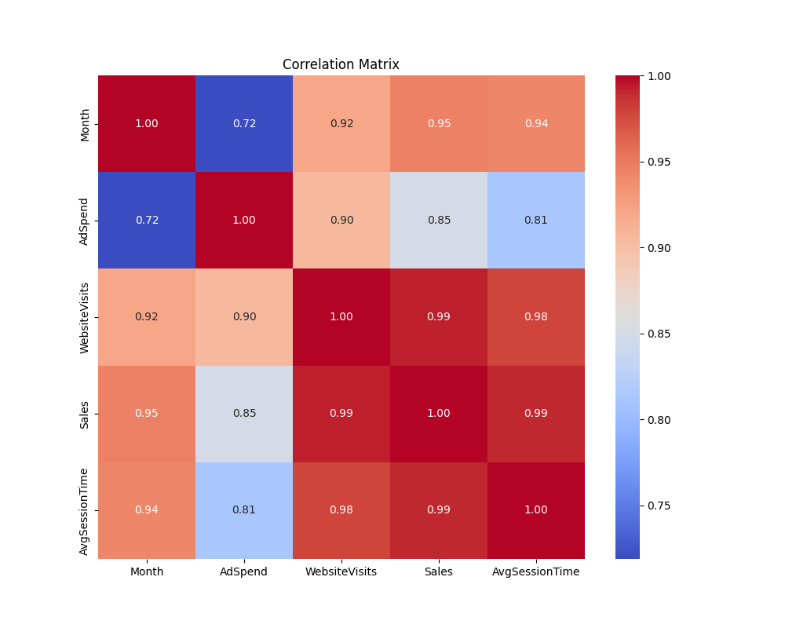
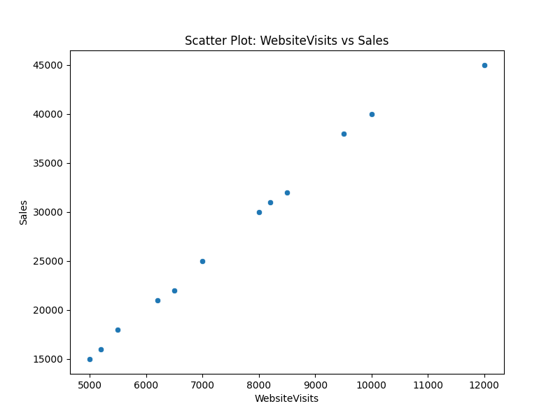

# Automated Data Analysis Report

## 1. Introduction
This report provides an automated analysis of the provided dataset. It highlights key correlations and identifies potential anomalies.

## 2. Correlation Analysis
The analysis identified a strong relationship between variables. The most significant correlation is between **WebsiteVisits** and **Sales** with a correlation coefficient of **0.99**.

### Correlation Matrix Heatmap

### Scatter Plot: WebsiteVisits vs Sales

## 3. Anomaly Detection
No significant anomalies were detected in the analyzed column.

## 4. Conclusion
This automated report is intended to provide a high-level overview of the data. Further investigation is recommended to understand the context behind these findings.
